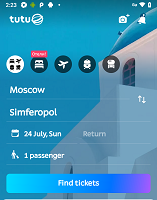
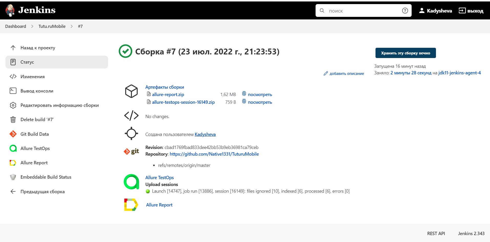
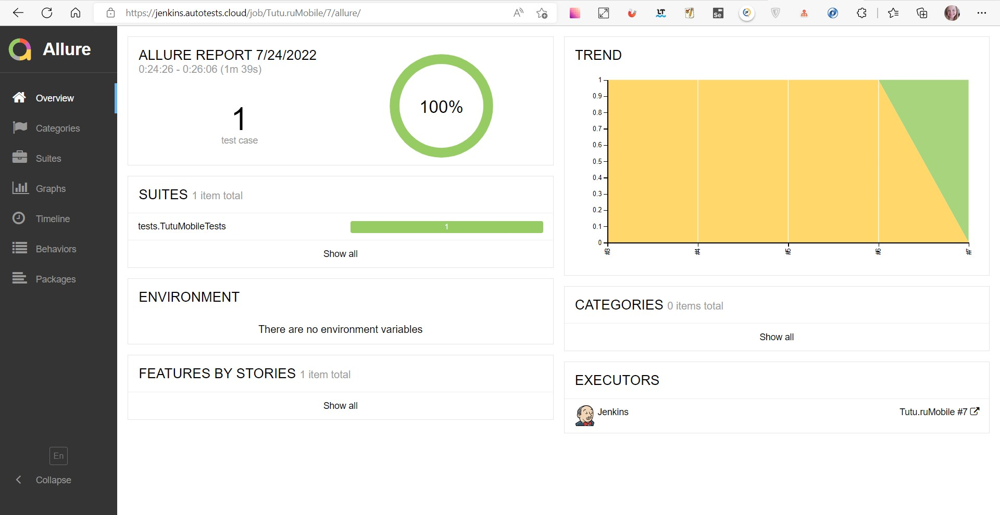
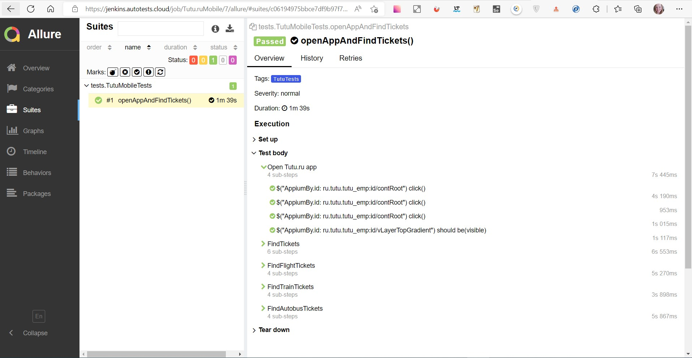
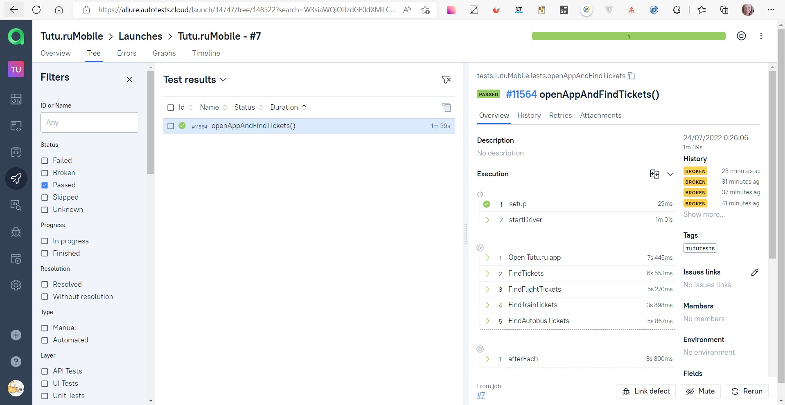
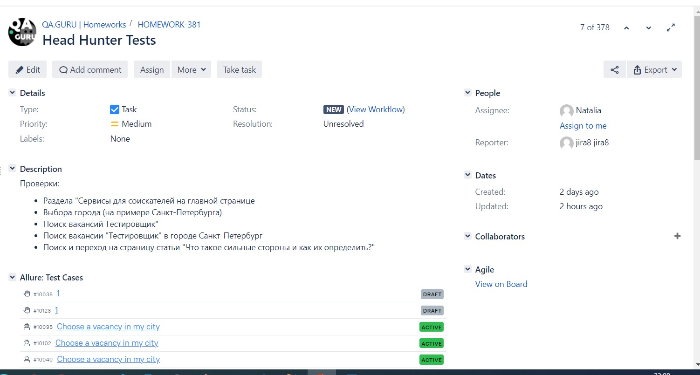
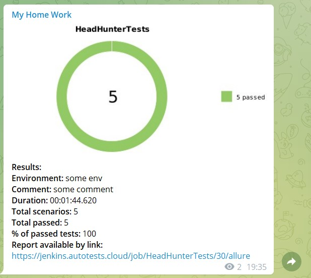

# Проект по автоматизации тестирования мобильного приложения Tutu.ru, покупка билетов всех видов транспорта	:star2:
## <a target="_blank" href="https://www.tutu.ru//">На данном сайте есть ссылка на мобильное приложение Tutu.ru </a> 

	

## :clipboard:: Содержание:

- <a href="#trophy-технологии-и-инструменты">Технологии и инструменты</a> 
- <a href="#heavy_check_mark-реализованные-проверки">Реализованные проверки</a>
- <a href="#clipboard_mark-сборка-в-Jenkins">Сборка в Jenkins</a>
- <a href="#computer-запуск-из-терминала">Запуск из терминала</a>
- <a href="#chart_with_downwards_trend-allure-отчет">Allure отчет</a>
- <a href="#bar_chart-интеграция-с-allure-testops">Интеграция с Allure TestOps</a>
- <a href="#chart_with_upwards_trend-интеграция-с-jira">Интеграция с Jira</a>
- <a href="#iphone-отчет-в-telegram">Отчет в Telegram</a>
- <a href="#movie_camera-видео-примеры-прохождения-тестов">Видео примеры прохождения тестов</a>

## :trophy:Технологии и инструменты
                                                                                                        
   </br>

## 	:heavy_check_mark: Реализованные проверки</br>
Наличие разделов на главной странице</br>
Поиск билетов из Москвы в Симферополь</br>
Поиск авиабилетов</br>
Поиск билетов на поезд</br>
Поиск билетов на автобус</br>
"</br>

## :clipboard: Сборка в Jenkins
### <a target="_blank" href="https://jenkins.autotests.cloud/job/Tutu.ruMobile/">Сборка в Jenkins</a>




###  :clipboard: Параметры сборки в Jenkins:
Сборка в Jenkins

- необходимо добавить файл browserstar.properties  и local.properties(содержащий в себе логины и пароли, отдельно для разных видов запуска, пример в папке resources)

## :computer: Запуск из терминала
Локальный запуск:
```
gradle clean test -Dhost=local

```

Удаленный запуск:
```
clean
test
 -Dhost=browserstack
```
## :chart_with_downwards_trend: Allure отчет
- ### Главный экран отчета

 


- ### Страница с проведенными тестами



## :bar_chart: Интеграция с Allure TestOps
- ### Экран с результатами запуска тестов
                                                                            


- ### Страница с тестами в TestOps


                                                                            
## :chart_with_upwards_trend:	 Интеграция с Jira
- ### Страница с задачей в Jira
                                                                                
 


## 	:iphone: Отчет в Telegram

 


## :movie_camera: Видео примеры прохождения тестов


https://user-images.githubusercontent.com/83497921/180654317-2ab4ad67-86e2-4c30-b066-f64c4b513eaf.mp4


:heart: <a target="_blank" href="https://qa.guru">qa.guru</a><br/>
:blue_heart: <a target="_blank" href="https://t.me/qa_automation">t.me/qa_automation</a>
